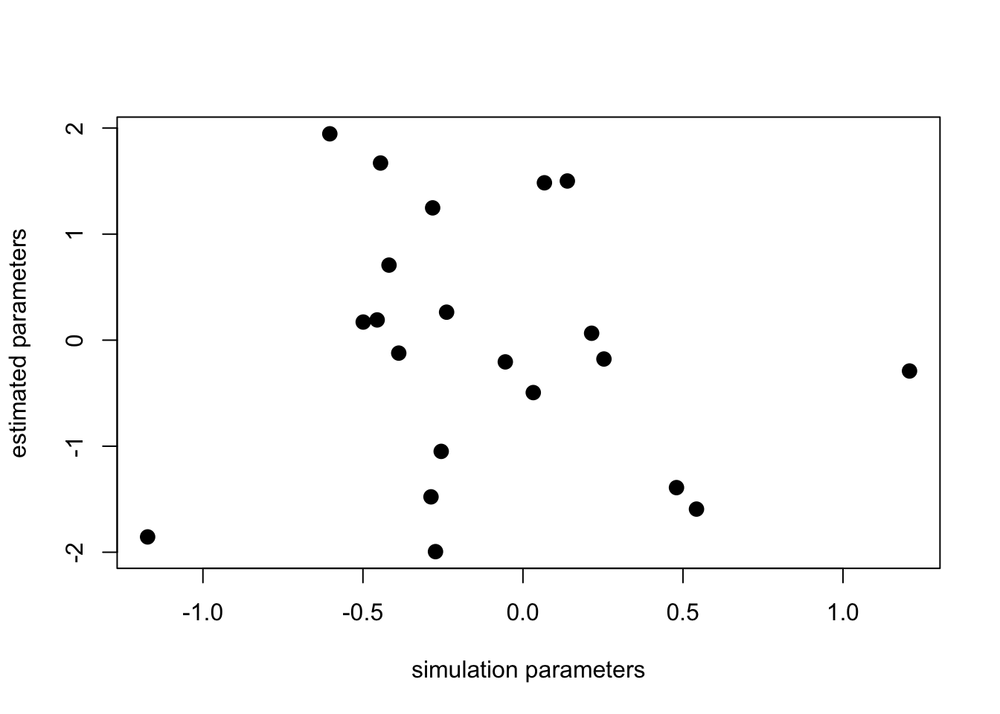

# Project 4

Posted: November 25, 2020

Due: December 8, 2020

## Part I: Classification

### Gradient Descent

<strong>Problem 1</strong> <em>Implement the gradient descent algorithm (either batch or stochastic versions) for multiple linear regression. I.e., extend the version of the algorithm in the lecture notes to multiple parameters.</em>

The gradient descent update equation for logistic regression is given by:

<!--

\[
\beta^{k+1} = \beta^k + \alpha \sum_{i=1}^{n} (y_i - p_i(\beta^k))\mathbf{x_i}
\]
-->

where (from the definition of log-odds):

<!--

\[
p_i(\beta^k) = \frac{e^{f_i(\beta^k)}}{1+e^{f_i(\beta^k)}}
\]

-->

and
<!--
\(f_i(\beta^k) = \beta_0^k + \beta_1^k x_{i1} + \beta_2^k x_{i2} + \cdots + \beta_p^k x_{ip}\).

-->

<strong>Problem 2</strong> <em>Derive the above update equation</em>. Write the derivation in a markdown ipynb cell. 

<strong>Problem 3</strong> <em>Implement the gradient descent algorithm (either batch or stochastic versions) for multiple logistic regression.</em> I.e., modify your code in problem 1 for the logistic regression update equation.

Make sure you include in your submission writeup, which version of the algorithm you are solving (stochastic or batch), and make sure to comment your code to help us understand your implementation.

<strong>Problem 4</strong> To test your programs, simulate data from the linear regression and logistic regression models and check that your implementations recover the simulation parameters properly.

Use the following functions to simulate data for your testing:

<pre class="r"><code>
&#35;simulate data for linear regression

gen_data_x, gen_data_y = sklearn.datasets.make_regression(n_samples=100, n_features=20, noise = 1.5)

&#35;simulate data for logistic regression.  This is similar to linear, only now values are either 0 or 1.  
log_gen_data_x, dump_y = sklearn.datasets.make_regression(n_samples=100, n_features=20, noise = 1.5)
log_gen_data_y = [0 if i>0 else 1 for i in dump_y]}</code></pre>

You can use this function as follows in your submission:

<pre class="r"><code>
&#35;a really bad estimator
&#35;returns random vector as estimated parameters
dummy = np.ndarray([100, 20])
for index, row in enumerate(dummy):
    dummy[index] = np.random.normal(0, .1, 20)
plt.plot(gen_data_x, dummy)</code></pre>

Include a similar plot in your writeup and comment on how your gradient descent implementation is working.

<h3>Try it out!</h3>

<ol style="list-style-type: lower-alpha">
<li>
Find a dataset on which to try out different classification (or regression) algorithms. 
</li>
<li>
Choose <strong>two</strong> of the following algorithms:
</li>
</ol>
<ol style="list-style-type: decimal">
<li>Linear Discriminant Analysis (LDA) (only classification)</li>
<li>classification (or regression) trees,</li>
<li>random forests 
</li>
<li>linear SVM,</li>
<li>non-linear SVM</li>
<li>k-NN classification (or regression)</li>
</ol>

and compare their prediction performance on your chosen dataset to your logistic regression gradient descent implementation using 10-fold cross-validation and a paired t-test (one for each of the two algorithms vs. your logistic regression code). Note: for those algorithms that have hyper-parameters, i.e., all of the above except for LDA, you need to specify in your writeup which model selection procedure you used.

<h3>Handing in:</h3>

<ol style="list-style-type: decimal">
<li>
For Problems 1 and 3 include your code in the writeup. Make sure they are commented and that the code is readable in your final writeup (e.g., check line widths).
</li>
<li>
For Problem 2, include the derivation of the gradient descent update in the writeup
</li>
<li>
For Problem 4, make sure you run the provided code and include the output in the writeup.
</li>
<li>
For the next section organize your writeup as follows:
</li>
</ol>
<ol style="list-style-type: lower-alpha">
<li>
Describe the dataset you are using, including: what is the outcome you are predicting (remember this should be a classification task) and what are the predictors you will be using.
</li>
<li>
Include code to obtain and prepare your data as a dataframe to use with your three classification algorithms. In case your dataset includes non-numeric predictors, include the code you are using to transform these predictors into numeric predictors you can use with your logistic regression implementation.
</li>
<li>
Specify the two additional algorithms you have chosen in part (b), and for algorithms that have hyper-parameters specify the method you are using for model selection.
</li>
<li>
Include all code required to perform the 10-fold cross-validation procedure on your three algorithms.
</li>
<li>
Writeup the result of your 10-fold cross-validation procedure. Make sure to report the 10-fold CV error estimate (with standard error) of each of the three algorithms. Also report on the result of the <em>two</em> paired t-tests comparing your logistic regression algorithm with your chosen two algorithms.
</li>
</ol>

<!DOCTYPE html PUBLIC "-//W3C//DTD HTML 4.01//EN" "http://www.w3.org/TR/html4/strict.dtd">
<html>

<body>
<h1 style="margin: 0.0px 0.0px 10.0px 0.0px; line-height: 45.0px; font: 38.0px 'Helvetica Neue'; color: #1d1d1d; -webkit-text-stroke: #1d1d1d">Part II: Interactive Data Maps</h1>
<!-- <h4 style="margin: 0.0px 0.0px 10.0px 0.0px; line-height: 22.0px; font: 18.0px 'Helvetica Neue'; color: #1d1d1d; -webkit-text-stroke: #1d1d1d"><i>CMSC320</i></h4>

<b>Posted: November 25, 2020</b> 
<b>Due: December 8, 2020</b> 

 -->

Use the Folium package and our Baltimore crime dataset to make an interactive data map of Baltimore Crime.

<ol class="ol1">
  <li class="li5">Use this piece of code to download and prepare data for use in project</li>
</ol>

!pip install folium

import folium

import requests

import pandas

 

arrest_table = pandas.read_csv("https://github.com/nayeemmz/cmsc320fall2020/blob/master/Project4/BPD_Arrests.csv")

<!-- 
 

arrest_table["race_new"] = arrest_table["sex"]

arrest_table["sex_new"] = arrest_table["race"]

arrest_table["race"] = arrest_table["race_new"]

arrest_table["sex"] = arrest_table["sex_new"]

arrest_table = arrest_table.drop('race_new', 1)

arrest_table = arrest_table.drop('sex_new', 1)

 

 -->

arrest_table = arrest_table[pandas.notnull(arrest_table["Location 1"])]

 

arrest_table["lat"], arrest_table["long"] = arrest_table["Location 1"].str.split(",").str

arrest_table["lat"] = arrest_table["lat"].str.replace("(", "").astype(float)

arrest_table["long"] = arrest_table["long"].str.replace(")", "").astype(float)

 

arrest_table.head()

<ol class="ol1">
  <li class="li5">Use the folium package to create an interactive map of Baltimore</li>
</ol>

map_osm = folium.Map(location=[39.29, -76.61], zoom_start=11)

map_osm

 

You can find more information about folium here: <a href="https://github.com/python-visualization/folium">https://github.com/python-visualization/folium/</a> and <a href="https://folium.readthedocs.org/">https://folium.readthedocs.org//</a>

<ol class="ol1">
  <li class="li4">Add graphical elements to display the data. For instance, add circles, with colors indicating sex. Or circles with colors indicating race. Or anything else that strikes your fancy. 
</li>
  <li class="li4">Embed your map in your iPynb notebook. 
</li>
</ol>
<h2 style="margin: 0.0px 0.0px 10.0px 0.0px; line-height: 36.0px; font: 30.0px 'Helvetica Neue'; color: #1d1d1d; -webkit-text-stroke: #1d1d1d">Submission</h2>

Prepare an iPynb notebook that includes: (a) code to carry out each of the steps above, (b) output showing the result of your code (for both classification and the interactive map), and (c) a short prose description of your classification code and the part for interactive map (i.e., what are you showing with this data and map). Remember, the writeup you are preparing is intended to communicate your data analysis effectively. Thoughtlessly showing large amounts of output in your writeup defeats that purpose. This will lead nicely into your final tutorial.

<h3 style="margin: 0.0px 0.0px 10.0px 0.0px; line-height: 29.0px; font: 24.0px 'Helvetica Neue'; color: #1d1d1d; -webkit-text-stroke: #1d1d1d">Group work</h3>

Working in groups in this project is encouraged but not required. If working on a group: (1) groups can be of 2 or 3 people, and (2) in all cases, names of peers who worked in the group should be included in the writeup.

As with all group work, and reflective of academic ethics code, there is an expectation that all group members will contribute equally in design, implementation and reporting of this work. If any student feels this expectation was not met when working on this project, they should contact the instructor team who will handle the situation as expediently and fairly as possible.

<h3 style="margin: 0.0px 0.0px 10.0px 0.0px; line-height: 29.0px; font: 24.0px 'Helvetica Neue'; color: #1d1d1d; -webkit-text-stroke: #1d1d1d">Submission</h3>

Submit an .ipynb file to ELMS  and a .pdf to Gradescope as usual. 

</body>
</html>

